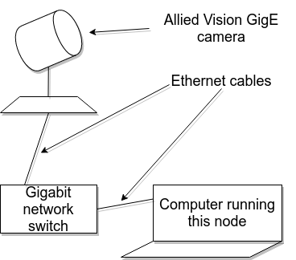

# ld-node-camera-avt-2

[](https://gitlab.com/link.developers/ld-node-camera-avt-2/commits/master)

## Motivation and Context

- This node is desiged to be an interface between Allied Vision GigE cameras and the link2 mesh. This node allows for configuration of the cameras and then the user is able to stream images captured from the camera (with desired framerate, image sizes, other camera settings) to the mesh.
- Internally, this node uses the Vimba SDK provided by the manufacturer to "talk" to the cameras. Then it records images from the camera and writes the same thing on the mesh in "Image" format. This "Image" is the "offer" of this node and the format is defined in [ld-lib-image](https://gitlab.com/link.developers/ld-lib-image).

## Hardware set-up
- The camera can be powered over ethernet or via a hirose connector. In this particular setup I have used the PoE solution. 
- The following is what we want to achieve with the end result being that we have a network using the ethernet on which both the camera and the computer running the node exist:


- We want to connect the camera to a computer which is running this node. For this to happen, it is needed to configure the IP and netmask for both camera and computer in such a way that they are on the same network.  
- The camera was connected to a D-Link DGS-1008P Gigabit network switch. The switch in turn was connected to the computer via another ethernet cable.
- Once you have this hardware set-up ready, now it is time to configure your IP and netmask on both camera and the computer with the aim of bringing them on the same network so that the camera is accessible to the aforementioned computer which is running the Vimba SDK and this node.
- One way to change the IP and the netmask of the camera is by using one native application called [VimbaViewer](https://usermanual.wiki/Document/Vimba20Viewer20Guide.226048809/help) which will be available when you install the SDK on your system. You can use this application to set persistent IP address and netmask for the camera. Steps to do this are present in the link above.  
- Next, you need to configure the IP address and netmask of your computer. Please refer to Page 18 of the [GigE installation manual](https://www.alliedvision.com/fileadmin/content/documents/products/cameras/various/installation-manual/GigE_Installation_Manual.pdf) to see how to do this, but to sum it up shortly for Linux system, you have to make changes to your `/etc/network/interfaces` file. You will add a new ethernet interface and you can bring up this interface using `sudo ifup <interface name>`. On Windows, you need to use tools via the control panel to do this. An additional step of running an `INSTALL` script packaged with the [Vimba SDK](https://www.alliedvision.com/en/products/software.html) and present under `VimbaGigETL` folder inside the packaged SDK.
- One important thing to note is that the netmask on both camera and computer need to be same and the IP address should also be such that, along with the netmask it should allow for the two things to be on same network. For example, a netmask of `255.255.0.0` for both and IP of `169.254.100.1` for computer and IP of `169.245.254.195`.
- It might be necessary to increase the MTU for your ethernet. On linux it is done by `sudo ifconfig eth0 mtu 8228` [Reference (Pg.20)](https://www.alliedvision.com/fileadmin/content/documents/products/cameras/various/installation-manual/GigE_Installation_Manual.pdf). This is necessary to enable `jumbo packets` for the communication between the camera and computer.
- Best way to check if the camera is working, is by using the "native apps" that ship with the [Vimba SDK](https://www.alliedvision.com/en/products/software.html). Follow the steps in the manual for the SDK installation and try to run the native applications (which come with the source code) to do basic troubleshooting with the camera. When you install the Vimba SDK, you will find a "Documents" folder which contain some important information and also there are folders is where these prebuilt binaries that use the camera in various ways exist and also the corresponding sources. Be sure to follow the [SDK installation manual carefully](https://www.stemmer-imaging.com/media/uploads/cameras/avt/11/111309-Allied-Vision---Vimba-Installation-under-Linux-Application-Note_Daz8paJ.pdf) and don't forget to supply `sudo -E` when you run the sample programs.

## The node in action

- When used by ld-node-image-2d-viewer-2:

  

## Installation

```
conda install ld-node-camera-avt-2
```

## Usage example

```
ld-node-camera-avt-2 --instance-file instance.json
```

## Specification

This node implements the following RFCs:
- https://draive.com/link_dev/rfc/012/README/

## Contribution

Your help is very much appreciated. For more information, please see our [contribution guide](./CONTRIBUTING.md) and the [Collective Code Construction Contract](https://gitlab.com/link.developers/RFC/blob/master/001/README.md) (C4).

## References
1. [GigE Installation manual](https://www.alliedvision.com/fileadmin/content/documents/products/cameras/various/installation-manual/GigE_Installation_Manual.pdf)
2. [Vimba Installation manual (for Linux)](https://www.stemmer-imaging.com/media/uploads/cameras/avt/11/111309-Allied-Vision---Vimba-Installation-under-Linux-Application-Note_Daz8paJ.pdf)
3. [Mako G Documentation](https://www.alliedvision.com/en/support/technical-documentation/mako-g-documentation.html)

## Maintainers

- Ritwik Ghosh (maintainer, original author)

This implementation is based on a [previous link version](https://gitlab.com/link.developers/ld-node-avt-camera) which was created by Tibi Tom Abraham.
